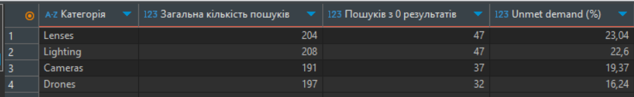
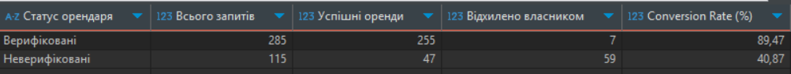
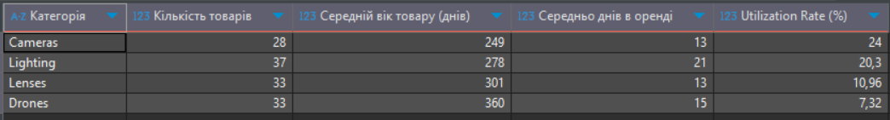
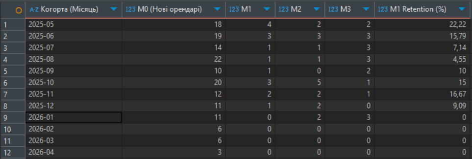

# GearShare - Product Analytics Case Study

> Languages: [Українська](README.md) | **English**

> **Product analytics pet project**: a hypothetical P2P marketplace for renting photo, video and lighting gear between individuals (an "Airbnb for cameras" model).
> The goal of this project is to walk through the full product analyst workflow: from designing the database schema and generating synthetic data, to formulating business questions, writing SQL queries and preparing recommendations for the product team.

---

## Business context

**GearShare** is a two-sided marketplace where owners of professional gear (`Owners`) rent it out to renters (`Renters`). The core product metrics I focus on in this case study:

- **Unmet Demand** - share of search queries that return zero results (signals inventory shortage).
- **Conversion Rate** - share of rental requests that reach `completed` status.
- **Utilization Rate** - share of time an asset is actually generating revenue for its owner (indicator of owner churn risk).
- **Retention Rate** - share of renters returning to the platform for a repeat rental (indicator of loyalty and LTV).

---

## Tech stack

| Tool | Purpose |
|---|---|
| **Python 3** (`pandas`, `Faker`) | Generating synthetic data with realistic business patterns |
| **PostgreSQL** | Data storage and analytical queries |
| **DBeaver** | DB connection, CSV import, executing SQL |
| **SQL** (CTE, JOIN, CASE, window / aggregate functions) | Product analytics |

---

## Repository structure

```
GearShare/
├── data_generation/
│   └── data_generation.py            # Synthetic data generation script
├── data/
│   ├── users.csv                     # 200 users
│   ├── items.csv                     # 150 gear items
│   ├── search_logs.csv               # 800 search queries
│   └── rentals.csv                   # 400 rental requests
├── Sql_scripts/
│   ├── create_tables.sql             # DDL: schema creation
│   ├── 01_search_to_fill.sql         # Unmet Demand analysis
│   ├── 02_cancellation_funnel.sql    # Cancellation funnel analysis
│   ├── 03_utilization_rate.sql       # Asset utilization analysis
│   └── 04_cohort_retention.sql       # Cohort retention analysis
├── images/                           # Query result screenshots
├── requirements.txt
└── README.en.md
```

---

## Data schema

Four related tables that mirror a typical P2P marketplace model:

| Table | Description | Key fields |
|---|---|---|
| `users` | Users (acting both as owners and renters) | `user_id`, `country`, `is_verified` |
| `items` | Gear items listed on the platform | `item_id`, `owner_id`, `category`, `daily_price`, `status` |
| `search_logs` | Search query log | `search_query`, `category_filter`, `results_count` |
| `rentals` | Rental requests and their statuses | `item_id`, `renter_id`, `total_price`, `status` |

> The data generator intentionally bakes in **business patterns** (for example, unverified renters have a higher cancellation probability) so that the SQL queries surface meaningful insights instead of random noise.

---

## How to reproduce locally

```bash
# 1. Clone the repo
git clone <repo-url>
cd GearShare

# 2. Install dependencies
pip install -r requirements.txt

# 3. Generate synthetic data (run from the project root)
python data_generation/data_generation.py

# 4. In PostgreSQL, run the DDL
#    Sql_scripts/create_tables.sql

# 5. Import the CSV files into the matching tables
#    (in DBeaver: Right-click table -> Import Data -> CSV)

# 6. Run the analytical queries
#    Sql_scripts/01_search_to_fill.sql
#    Sql_scripts/02_cancellation_funnel.sql
#    Sql_scripts/03_utilization_rate.sql
#    Sql_scripts/04_cohort_retention.sql
```

---

## Analytical queries and insights

### Query 1. Unmet Demand - which categories are we losing users in?

**File:** [`Sql_scripts/01_search_to_fill.sql`](Sql_scripts/01_search_to_fill.sql)

**Business question:** Which categories have the largest supply gap on the platform?

**Method:** for each category, compute the share of searches with `results_count = 0` over the total number of searches.



**Insight:** two categories show high **Unmet Demand**:
- **Lenses** - 23% of searches return zero results
- **Lighting** - 22%

**Recommendation for the product team:**
Have the **Acquisition team** focus inventory growth on these niches. Possible tactics:
- A promo campaign with **reduced commission** for new owners of lenses and studio lighting.
- A **first-transaction bonus** for owners listing items in shortage categories.
- Partnerships with rental studios in those categories to seed inventory.

---

### Query 2. Cancellation Funnel - how does verification affect conversion?

**File:** [`Sql_scripts/02_cancellation_funnel.sql`](Sql_scripts/02_cancellation_funnel.sql)

**Business question:** How does renter KYC verification affect the probability of a successfully completed deal?

**Method:** segment `rentals` by renter's `is_verified` flag and compute the Conversion Rate into `completed`.



**Insight:** the trust & safety factor has a **critical impact** on conversion:
- **Verified** users: Conversion Rate = **89.47%**
- **Unverified** users: Conversion Rate = **40.87%**

Key observation: the bulk of cancellations are `cancelled_by_owner` - i.e., owners proactively reject unverified renters because they do not trust them with thousands of dollars worth of gear.

**Recommendation for the product team:**
Make **KYC a mandatory onboarding step** *before* a renter can send their first rental request. Expected effects:
- less owner frustration from "junk" requests
- less renter frustration from rejections
- higher overall marketplace conversion and NPS

> **Caveat:** before rolling this out, run an A/B test on a portion of traffic to make sure the extra onboarding friction does not reduce the active renter base by more than the conversion uplift.

---

### Query 3. Utilization Rate - which categories are sitting idle?

**File:** [`Sql_scripts/03_utilization_rate.sql`](Sql_scripts/03_utilization_rate.sql)

**Business question:** What percentage of the time is gear actually being rented out?

**Method:** with two CTEs we compute `days_on_platform` (an item's lifecycle) and `total_rented_days` (days spent in `completed` rentals), then divide one by the other.



**Insight:** there is a significant imbalance across categories:
- **Cameras** - the most liquid category, rented out **24%** of the time.
- **Drones** - sit idle **>92%** of the time (Utilization Rate = **7.32%**).

Long drone idle time creates a **critical owner churn risk** - if an asset stops generating income, the owner delists it from the platform.

**Recommendation for the product team:**
1. **Qualitative research:** interview / survey drone owners to understand the cause of the low demand (price too high? fear of damage? poor search visibility?).
2. **Quick win:** introduce **dynamic pricing** with discounts on long weekend drone rentals.
3. **Trust booster:** offer optional drone insurance - this can reduce the renter's fear of damaging the gear.

---

### Query 4. Cohort Retention - are renters coming back?

**File:** [`Sql_scripts/04_cohort_retention.sql`](Sql_scripts/04_cohort_retention.sql)

**Business question:** What share of renters return to the platform for a repeat rental in the months following their first successful rental?

**Method:** a three-stage CTE pipeline:
1. `user_cohorts` - find each user's first `completed` rental month (their cohort).
2. `rental_months` - bucket all of their successful rentals to monthly grain.
3. `cohort_data` - compute `month_index` (months since the first rental) using `EXTRACT(YEAR/MONTH)`.
4. The final `SELECT` builds the M0 / M1 / M2 / M3 matrix via `COUNT(DISTINCT CASE WHEN month_index = N ...)` and computes M1 Retention with safe division through `NULLIF`.



**Insight:** retention is **critically low** and inconsistent across cohorts:
- Average M1 Retention varies in the **0-22%** range across cohorts.
- The best cohort (May 2025) only retained **22.22%** of users into the next month.
- Most cohorts land at **5-15%** M1 Retention - i.e., out of 10 new renters only 1, maybe 2 come back.
- Cohort sizes shrink over time (from ~18-22 in mid-2025 down to 3-6 in 2026), which additionally signals a problem with acquisition channels.
- M0 (new renters in the month) substantially exceeds the sum of M1+M2+M3, confirming that the platform behaves as a "one-shot service" rather than a habit-forming product.

**Recommendation for the product team:**
1. **Post-rental activation loop:** an automated email/push 3-5 days after a `completed` rental with a personalised recommendation of similar items or complementary categories (rented a camera -> suggest a lens + lighting kit).
2. **Loyalty mechanic:** a discount on the second rental within 30 days (e.g. -15%) to nudge users into a return habit.
3. **Investigate churn drivers:** interviews / NPS surveys with users who completed exactly 1 rental 30+ days ago. Hypotheses to test: one-off use case (wedding / vacation), poor gear quality, friction in the repeat-booking flow.
4. **Expand retention metrics:** break cohorts down by `country`, by first-rental category and by `daily_price` segment to find **which segments retain best** and double-down on them in marketing.

> **Caveat:** with the small synthetic dataset (400 rentals over a year), individual cohort cells contain few users, which makes single M1 Retention values statistically unstable. On real data I would also compute a 95% confidence interval for each cell of the matrix.

---

## Why this project is relevant for a Junior Product Analyst role

- **I think in product, not in tables.** Every query starts with a **business question** and ends with a **recommendation for the team** - not just a SELECT statement.
- **I am comfortable with SQL.** The project uses CTEs (including multi-stage), aggregate functions, CASE logic, JOINs, NULL-handling via `COALESCE` and `NULLIF`, `HAVING` filters, and date functions (`DATE_TRUNC`, `EXTRACT`).
- **I understand marketplace product metrics.** Unmet Demand, Conversion Rate, Utilization Rate, Cohort Retention - the classic two-sided platform framework.
- **I can design an end-to-end study independently** - from data schema to insight.
- **I am aware of methodological limitations** - e.g. the mandatory-KYC recommendation needs to be validated through an A/B test, and small cohorts call for confidence intervals.

---

## Contact
- TG - @ytopoc
- Linkedin - https://www.linkedin.com/in/volodymyr-yarovoi/
- Email - telephonevovan@gmail.com

Happy to receive feedback and discuss the project!
